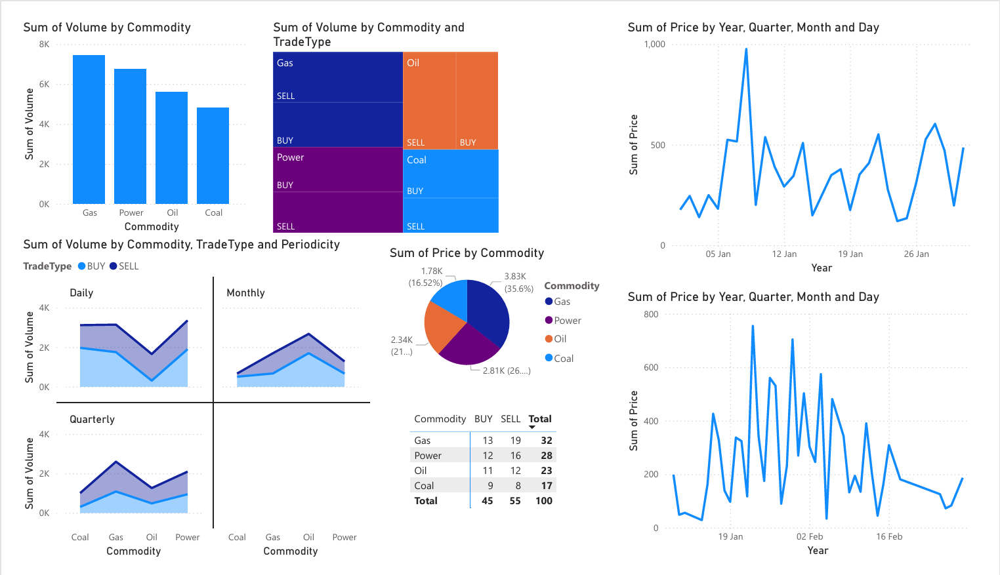

# ETRM Data Analysis with Pandas & Visualization

## 📊 Project Overview

This project demonstrates comprehensive data analysis and visualization of synthetic Energy Trading and Risk Management (ETRM) trade data using Python's Pandas library and various visualization tools. The analysis covers data ingestion from multiple file formats, data transformation, exploratory data analysis, and interactive visualizations.

## 🎯 Objective

To practice and showcase skills in:
- Multi-format data ingestion and processing
- Data cleaning and transformation techniques
- Exploratory Data Analysis (EDA)
- Data visualization using Python libraries
- Business intelligence reporting with Power BI

## 📁 Dataset Description

The project uses synthetic ETRM trade data containing **100 trades** across multiple file formats:

### File Formats Analyzed:
- 📄 **CSV** (`etrm_trades.csv`)
- 🔧 **JSON** (`etrm_trades.json`)
- 📊 **Excel** (`etrm_trades.xlsx`)
- 📝 **Text/Pipe-delimited** (`etrm_trades.txt`)
- 🌐 **HTML** (`etrm_trades.html`)
- 📋 **XML** (`etrm_trades.xml`)

### Data Schema:
| Field | Description | Data Type |
|-------|-------------|-----------|
| TradeID | Unique trade identifier | String |
| Trader | Name of the trader | String |
| Commodity | Type of commodity traded | String |
| Volume | Trade volume | Numeric |
| Price | Price per unit | Numeric |
| Currency | Trading currency | String |
| DeliveryStart | Delivery start date | DateTime |
| DeliveryEnd | Delivery end date | DateTime |
| Periodicity | Trade frequency (Daily/Weekly/Monthly) | String |

## 🛠️ Technical Stack

- **Python 3.8+**
- **Pandas** - Data manipulation and analysis
- **Matplotlib** - Static plotting
- **Seaborn** - Statistical visualization
- **Plotly** - Interactive visualizations
- **Jupyter Notebook** - Development environment
- **Power BI** - Business intelligence dashboard

## 📋 Analysis Steps

### 1. Data Ingestion 🔄
- **Multi-format Loading**: Successfully loaded all 6 file formats into Pandas DataFrames
- **Data Consistency Verification**: Ensured uniform column names and data types across all datasets
- **Format-specific Parsing**: Handled unique requirements for each file format (XML parsing, HTML table extraction, etc.)

### 2. Data Cleaning & Transformation 🧹
- **DateTime Conversion**: Transformed `DeliveryStart` and `DeliveryEnd` columns to proper datetime format
- **Data Type Optimization**: Ensured appropriate data types for numerical and categorical columns
- **Missing Value Handling**: Identified and addressed any data quality issues
- **Data Validation**: Cross-validated data consistency across all file formats

### 3. Exploratory Data Analysis (EDA) 🔍

#### Key Metrics Analyzed:
- **Average Price per Commodity**: Identified pricing patterns across different commodities
- **Currency Distribution**: Analyzed the distribution of trades across different currencies
- **Trade Periodicity Breakdown**: Examined the frequency distribution of daily, weekly, and monthly trades
- **Volume Analysis**: Investigated trading volumes by trader and commodity
- **Temporal Patterns**: Analyzed trading patterns over delivery periods

### 4. Data Visualizations 📈

#### Created 5+ Comprehensive Visualizations:

1. **📊 Bar Chart**: Volume by Trader
   - Shows trading activity levels across different traders
   - Identifies top performers and trading patterns

2. **🥧 Pie Chart**: Trades by Currency
   - Visualizes currency distribution in the trading portfolio
   - Highlights dominant currencies in the market

3. **📈 Line Chart**: Average Price Trend by Delivery Start Date
   - Reveals price trends over time
   - Identifies seasonal or temporal price patterns

4. **📊 Histogram**: Distribution of Notional Values
   - Shows the distribution of trade values
   - Identifies common trade sizes and outliers

5. **🔥 Heatmap**: Commodity vs. Trader Trade Counts
   - Reveals trading preferences and specializations
   - Shows correlation between traders and commodities

#### Visualization Features:
- ✅ Proper labels and titles
- ✅ Color-coded legends
- ✅ Interactive elements (where applicable)
- ✅ Clear readability and professional styling
- ✅ Actionable insights and annotations

## 📊 Power BI Dashboard

### Enhanced Business Intelligence Reporting



*Add your Power BI screenshot here*

The Power BI dashboard provides:
- **Interactive Filters**: Dynamic filtering by trader, commodity, currency, and date range
- **KPI Cards**: Key performance indicators including total volume, average price, and trade count
- **Drill-down Capabilities**: Detailed analysis from high-level metrics to individual trades
- **Cross-filtering**: Synchronized filtering across all visualizations
- **Mobile Responsiveness**: Optimized for viewing on different devices

### Dashboard Components:
1. **Executive Summary**: High-level KPIs and trends
2. **Trader Performance**: Individual trader analysis and rankings
3. **Commodity Analysis**: Market share and price trends by commodity
4. **Geographic Distribution**: Trading activity by region/currency
5. **Temporal Analysis**: Time-based trends and seasonality patterns

## 🚀 Getting Started

### Prerequisites
```bash
pip install pandas matplotlib seaborn plotly jupyter openpyxl lxml beautifulsoup4
```

### Installation & Setup
1. **Clone/Download the repository**:
   ```bash
   git clone [your-repository-url]
   cd "ETRM Data Analysis with Pandas &"
   ```

2. **Install dependencies**:
   ```bash
   pip install -r requirements.txt
   ```

3. **Launch Jupyter Notebook**:
   ```bash
   jupyter notebook notebooks/etrm_analysis.ipynb
   ```

4. **Run the analysis**:
   ```bash
   python scripts/data_analysis.py
   ```

